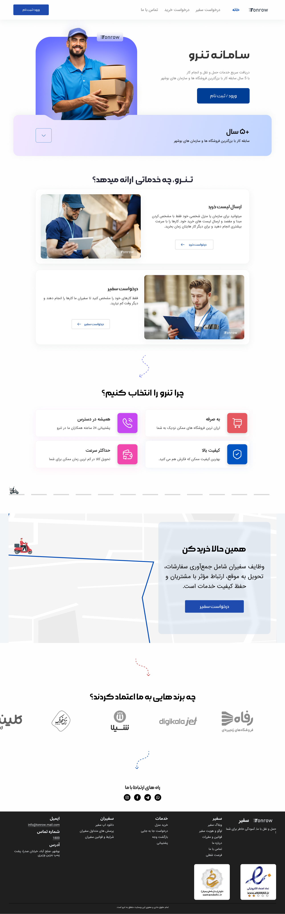

# Tonrow[LandingPage]

#### Landing Project of Tenro Website Based on Figma's selected plan

## developer :

- Fatemeh Satouri

## About the project:
This project is Landing of the Tonrow Iranian site. In this project, we tried to make the code using the JavaScript pure. This site is styled using CSS and DIV was using Display Flex. This Landig has 4 pages, the only difference being in the menu. The project has tried to use interesting strategies.

This site is completely respected and can be easily worked with with mobile phones.

## about me :
Hi i am Fatemeh Satouri .
Programmer and User Interface Designer.
I always said it is hard to fight logic and emotion and still love the love of logic.

I have been working seriously for a few months.
And I believe that science must be experienced, coding should be so coded until it is learned.
Hope you follow most of my work in the future.

## Working with the project:
This is a pure Franz project.
You can change the header of the project header by changing the header variable that I will leave in the future.

You can also enjoy the interesting animation and effects of the site.
A site with calm colors.
Open the project and hover on the buttons and wait to see the animations well. Maybe you loved her like me.

## Strategy Explanation:
> click on image 👆🏻

